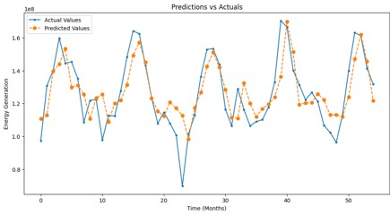
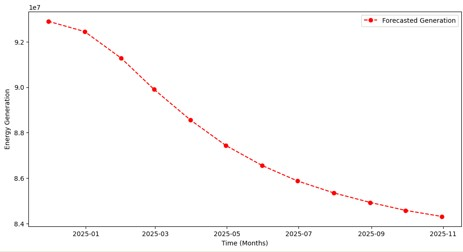
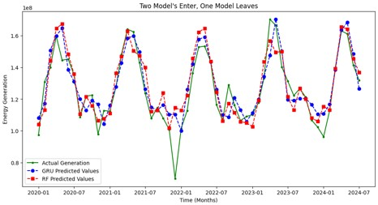
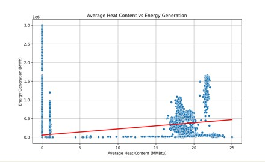
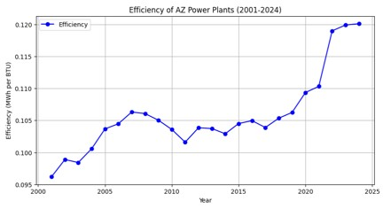
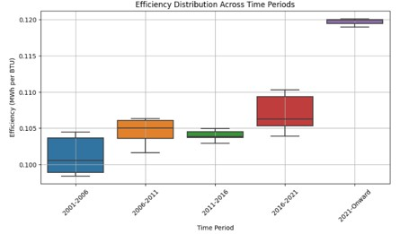

# Predicting Arizona’s Energy Requirements
Capstone Project

## Overview
This capstone project analyzes Arizona's energy consumption and generation patterns using historical data from 2001 to 2024. The analysis includes forecasting energy trends, examining the relationship between fuel type and heat content, and assessing efficiency improvements over time. The study integrates machine learning, time series models, and statistical testing to inform energy policy, planning, and sustainability efforts.

## Research Questions

1. **Forecasting Energy Patterns**  
   How accurately can we forecast future energy consumption and production patterns using machine learning models?

2. **Fuel Type & Heat Content**  
   What is the relationship between fuel type and the average heat content in Arizona's power plants, and how does this impact total energy production?

3. **Efficiency Over Time**  
   Has the efficiency of AZ power plants improved since 2001 (energy consumed vs generation) - or are we just ramping up production without efficiency?

## Methods

### Data Sources
- **US EIA Open Data API**: Electric power operations for Arizona (2001–2024)
- **NOAA**: Local climatological data for environmental variables
- Over 100,000+ observations across time

### Models & Techniques
- **Machine Learning**:
  - Gated Recurrent Unit (GRU)
  - Bidirectional RNN (BRNN)
  - Random Forest
- **Time Series Forecasting**:
  - ARIMA
  - SARIMA
- **Statistical Testing**:
  - T-tests
  - ANOVA
  - Time Series Decomposition
- **Evaluation Metrics**:
  - Mean Squared Error (MSE)
  - Root Mean Squared Error (RMSE)
  - Mean Absolute Error (MAE)
  - R² Scores

## Key Findings

- **Forecasting Accuracy**:  
  GRU and Random Forest models performed well on historical data. However, forecast accuracy declined in 2023–2024 due to sparse data reporting.

- **Fuel & Heat Content**:  
  Coal and natural gas dominate Arizona's energy mix. A weak correlation (R² = 0.05) between fuel heat content and energy output indicates other factors influence generation efficiency.

- **Efficiency Trends**:  
  Significant improvements in power plant efficiency were observed post-2021. Time series decomposition confirmed upward trends with seasonal and residual patterns.

## Recommendations

- Conduct individual plant analysis to identify low-performing facilities
- Improve data reporting consistency from state agencies
- Invest in advanced forecasting models with real-time updates
- Expand support for solar, wind, and battery storage infrastructure

## Visual Highlights

### GRU Forecasting Accuracy

### GRU 12-Month Forecast

### Random Forest vs GRU

### Heat Content vs Energy Generation

### Efficiency Over Time

### Efficiency Group ANOVA

## Project Contents

- **[Presentation Slides](./DAT490_FinalPresentation.pptx)**  
  Summary of models, results, and recommendations

-  **Full PDF report available upon request**  
  (Due to file size limits, full report not hosted in this repo. Contact for access.)

## Team
- Bryan Katterman (Team Lead)  
- Amilcar Hernandez (Analyst)  
- Zoey Gabbard (Analyst)  
- Kiara Zepeda (Analyst)

## Sources

- [Arizona State Energy Profile – U.S. EIA](https://www.eia.gov/state/print.php?sid=AZ)  
- [EIA Open Data API – Facility-Level Generation](https://www.eia.gov/opendata/browser/electricity/facility-fuel?state=AZ)  
- [NOAA Local Climate Data](https://www.ncdc.noaa.gov/cdo-web/datatools/lcd)

